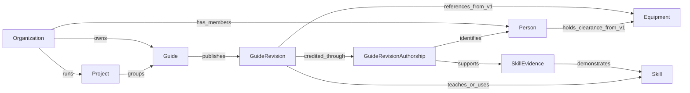

# MakerNet Product Architecture

**Author:** Anuj Bora  
**Date:** September 24, 2026  
**Scope:** Product model, core workflows, trust rules, and phased technical architecture for a single-college rollout.

## Executive Summary

MakerNet connects people, practical knowledge, equipment, and campus organizations through one shared skill graph. A guide can provide evidence that a contributor has applied a skill, while the same skill connects readers to related guides, qualified helpers, and equipment. Skill evidence is attributed to a person's recorded contribution; authorship alone does not prove every skill taught by a guide.

The v0 MVP must prove one loop: a member publishes a guide, records each contributor's work, and makes both the guide and accepted skill evidence discoverable through one search experience. The platform will begin as a modular monolith backed by Postgres and college single sign-on. Public browsing is limited to content and profile fields that members explicitly make public; every search, notification, recommendation, and media request applies the same visibility rules within the revocation limits defined below.

## Product Goals and Success Measures

1. **Find credible help quickly.** A member should reach a useful profile or guide for a supported skill within 30 seconds. Measure median time to the first useful result or contact action, search success rate, and zero-result rate.
2. **Reuse documented work.** Members should find an existing guide before repeating a solved problem. Measure guide views that lead to a solved confirmation, forks, and the share of searches that end on a guide.
3. **Make documentation part of project completion.** A team should be able to publish a useful project record without repeating attribution or skill data entry. Measure median time from draft creation to publication and the share of published guides with accepted contributor evidence.

These goals describe the target product. The release plan at the end of this document defines which parts are available in each phase.

## Core User Journeys

### Find a person or guide by skill

This journey describes the target experience. The v0 MVP includes people and guides with self-declared or accepted guide-backed evidence. Equipment results and clearances arrive in v1; peer endorsements arrive in v1; optional staff-reviewed evidence arrives in v2.

1. A visitor or member searches for a canonical skill or an alias.
2. MakerNet expands the query through the skill taxonomy, applies the viewer's access rules, and returns people, guides, and equipment in one result set.
3. People rank by evidence strength, evidence freshness, and willingness to help. Popularity alone does not determine rank. Proficiency is displayed only after MakerNet has a tested rubric; it does not affect v0 ranking.
4. The result distinguishes self-declared, guide-backed, peer-endorsed, staff-reviewed, and equipment-certification signals.
5. An authenticated member can send a contact request to someone who is open to help. Recipients can decline, mute, or block future requests.

### Publish a multi-author guide

This is the target journey. In v0, authors use a structured risk declaration and a controlled list of hazardous activities and materials. Selecting canonical equipment and publishing equipment-directory links begins in v1.

1. A member creates a private draft and selects canonical skills, visibility, guide type, and risk metadata. Equipment can also be selected when the v1 equipment feature is enabled.
2. A maintainer invites collaborators and records each person's proposed role, contribution, and evidence candidates on the draft.
3. Each collaborator accepts the credit and can accept, edit, or reject each evidence candidate. Pending invitees and their evidence remain undisplayed; they do not block publication.
4. Publication atomically creates an immutable guide revision and revision-attribution snapshot, activates accepted evidence against that revision, and writes an outbox event. Workers then index the revision and deliver notifications.
5. Later edits begin in a new draft based on a specific revision. Optimistic version checks prevent two maintainers from publishing competing next revisions. Historical attribution and moderation records remain intact.

### Request help

In the v0 MVP, an authenticated member can send a mediated contact request from a search result. The recipient sees it in an in-app inbox and receives a college-email alert unless email alerts are disabled. Requests expire, and delivery, response, decline, block, and expiry are recorded. The Help Wanted board arrives in v1 and adds a structured request, responses, resolution, and the option to promote a useful answer into a guide. Rate limits, reporting, blocking, and notification preferences apply to both flows.

## Product Model

The shared model centers on canonical skills. People hold skill claims and evidence, guide revisions teach or use skills, organizations contain people and own work, projects group guides, and equipment connects to guides and active clearances from v1. A club, lab, or department is an `Organization` type; "club" is not a separate data concept.

### People Directory and Skill Search

- A profile groups skills by category and shows the evidence supporting each one. It also lists accepted guide credits, organization affiliations, and an **Open to help** setting.
- Evidence types remain distinct: **Self-declared**, **Guide-backed**, **Peer-endorsed**, **Staff-reviewed**, and **Active equipment clearance**. MakerNet does not combine these into a single ambiguous "verified" label.
- The taxonomy begins with a small moderator-maintained tree, such as Electronics > Soldering > Micro-soldering. Alias records map terms such as "solder" to the canonical skill and preserve merge history. Suggested merges can be added after v0.
- Search supports alias matching, taxonomy expansion, and fuzzy terms. Results can be filtered by organization, evidence type, and willingness to help. A future proficiency filter requires a defined rubric and validation before launch.
- Guide-backed evidence belongs to a person, guide revision, contribution, and skill. Mentor and documenter roles do not receive skill evidence by default.

### Knowledge Repository

- Guide types are **How-to**, **Project log**, **Troubleshooting note**, and **Tool primer**.
- A guide contains a goal or problem, prerequisite skills, tools and bill of materials, steps with media, pitfalls or lessons, related guides, and revision history.
- Published revisions are immutable snapshots. An update creates a new draft and revision; a material safety change gives the new revision a fresh safety-review state.
- A fork links the new guide to its parent and preserves original attribution.
- Discovery includes skill and equipment pages, full-text search, related guides, and privacy-safe logging of zero-result searches.
- Quality signals include helpful votes, solved confirmations, staff review of a specific revision, reports, and risk-based review dates. Equipment changes, reported problems, and obsolete parts can make a guide stale before a fixed time limit.

### Multi-Author Guides and Projects

Draft contribution records use one of five roles: **Lead Author**, **Co-author**, **Contributor**, **Mentor or Advisor**, or **Documenter**. A person must accept an invitation before MakerNet displays the credit or derives evidence from it. Publication snapshots accepted attribution in `GuideRevisionAuthorship` and creates or activates separate `SkillEvidence` records that reference it.

An authenticated member can propose an edit against the effective visible revision. A maintainer accepts, rejects, or requests changes; acceptance creates or updates a draft based on that revision. A proposal against an older base revision must be rebased or rejected before merge.

A `Project` groups guides and a team roster for long-running builds. Original authorship remains attached to each guide, while a separate maintainer list allows a team to hand responsibility to a later cohort. Project support is planned for v1.

### Skill and Equipment Hubs

A skill page shows guides that teach or use the skill and people with visible evidence for it. From v1, an equipment page shows visible guides, required skills, location information, and active clearances where policy allows them to be displayed. Equipment clearance is never inferred from authorship, endorsements, or solved confirmations.

## Trust, Safety, and Permissions

### Roles

| Role | Scope | Main permissions |
| --- | --- | --- |
| Member | Own content and allowed organizations | Create guides, propose edits, accept credits, comment, and send contact requests; endorse when v1 ships |
| Organization officer | One organization | Manage membership and organization pages; pin organization guides |
| Site moderator | Site-wide moderation | Review reports, quarantine or restore content, manage taxonomy merges, and record enforcement reasons |
| Staff reviewer | Assigned skill or equipment scope | Review guide revisions and issue, renew, or revoke equipment clearances within the assigned scope when the v1 equipment feature ships |
| Administrator | Site configuration | Assign privileged roles, manage integrations, and operate the service |

Privileged actions record the actor, scope, reason, and time in an append-only audit history. Moderators quarantine, restore, or propose corrections; they do not silently rewrite an author's guide. Role assignment follows least privilege, and organization officers do not receive site-wide moderation power.

The creator becomes the initial owner-maintainer of an independent guide. An organization may own a guide only through an audited transfer accepted by an authorized organization officer. Maintainer scopes are **Manage contributors**, **Publish revisions**, **Change visibility**, **Archive**, and **Manage maintainers**. A maintainer with **Manage maintainers** may grant or revoke scopes, but cannot remove the last active owner-maintainer. Lead-author credit does not grant management rights by itself. Project maintainers receive guide rights only through an explicit grant. When an individual owner departs, stewardship transfers to an accepted co-maintainer or the owning organization; otherwise the guide becomes archived until an administrator completes an audited transfer.

### Visibility and Contact Rules

| Level | Who can discover and open it |
| --- | --- |
| Public | Anyone, including anonymous visitors |
| College-only | Authenticated members of the college |
| Organization-only | Current members of the selected organization |
| Private draft | Accepted authors and explicitly invited collaborators |

Profiles and their institutional attributes default to college-only. A fixed profile projection gives each field or section its own audience setting: name, photo, biography, year, department, organizations, skill claims, evidence items, and willingness to help. An organization-only audience includes the organization ID. Effective visibility is the most restrictive rule from the profile field, accepted revision credit, supporting guide revision, evidence record, organization membership, and equipment policy. Restricted evidence text never enters a public search document. Private drafts never enter shared indexes. Authorization filters run before search ranking, recommendations, analytics, notification fanout, and media delivery. Changing visibility removes stale index entries and prevents later notification access.

Each contributor accepts both credit and its maximum audience for a revision. Widening a guide's visibility requires renewed consent from contributors whose accepted audience is narrower. Until they consent, the public byline uses their chosen pseudonym or "Contributor," and their profile and evidence remain undisclosed. This rule also governs later pseudonymization after departure.

Contact uses an in-product request or privacy-preserving relay. Members can disable requests, block senders, control digest frequency, and report abuse. Rate limits and spam controls apply to invitations, comments, endorsements, contact requests, help posts, and reports.

### Guide Lifecycle and Safety Review

Guide availability and revision safety are separate state machines:

| Record | States | Visibility effect |
| --- | --- | --- |
| Guide | Active, Archived, Removed | Archived guides remain readable but leave normal discovery; removed guides are unavailable to ordinary viewers |
| Guide draft | Draft, Ready, Published, Abandoned | Visible only to maintainers and invited collaborators |
| Guide revision publication | Current, Superseded, Withdrawn | Only the current eligible revision appears by default |
| Guide revision safety | Not flagged, Under review, Cleared, Quarantined | Under-review revisions remain visible with a warning under the locked policy; quarantined revisions are unavailable to ordinary viewers |

The locked product decision is post-publication review: guides may publish without a faculty pre-publication gate. The publish form requires a structured risk declaration, and deterministic rules inspect selected metadata, the title, steps, bill of materials, attachment metadata, skills, and v1 equipment references in the publish transaction. Declaration mismatches create a moderation case. When those rules, a moderator, or a report identifies fire, high voltage, hazardous chemicals, dangerous machinery, or comparable risks, the published revision enters **Under review**, displays that status, and enters a priority queue. An overdue case escalates after one business day. Authorized reviewers can quarantine it at once.

Every read path resolves an `effective_visible_revision`: normally the current revision, or a prior eligible revision only when a reviewer explicitly confirms that the reported risk does not affect it. A moderation case can suppress all fallback. Search, direct links, notifications, evidence display, APIs, and media use the same resolver. Quarantine or withdrawal does not automatically reactivate evidence from a prior revision; the resolver and evidence projection are recomputed. A material safety change gives the new revision a fresh safety-review state.

Reports create moderation cases with status, owner, evidence, action history, and an appeal path. Removal does not erase authorship, revision, or audit records needed for accountability.

## Core Data Model

| Entity | Purpose | Key fields |
| --- | --- | --- |
| Person | Member identity and account state | identity provider or issuer, provider subject, name, status, eligibility end date |
| ProfileFieldVisibility | Audience for each profile field or section | person, field key, audience type, audience organization, updated at |
| Organization | Club, lab, or department | name, type, visibility |
| OrganizationMembership | Scoped membership and role | person, organization, role, status, start and end dates |
| Skill | Canonical taxonomy node | name, parent skill, category, status |
| SkillAlias | Searchable alias or redirect | normalized alias, skill, locale, status, created by |
| PersonSkillClaim | A member's self-declared skill | person, skill, statement, visibility, status |
| PersonSkillProjection | Rebuildable read model for search and display | person, skill, visible evidence counts, freshness, audience type, audience organization |
| SkillEvidence | Contribution-specific source record | person, skill, revision authorship, status, accepted at, activated at, visibility |
| Endorsement | Evidence-linked peer endorsement | endorser, recipient, skill, evidence reference, note, status |
| Guide | Stable guide identity and administration | creator, owner type, owner person or organization, type, visibility, status, current revision, effective visible revision |
| GuideMaintainer | Explicit guide stewardship | guide, person, scope, status, granted by |
| GuideDraft | Mutable content based on a revision | guide, base revision, payload, lock version, status, updated by |
| GuideEditProposal | Proposed change from a non-maintainer | guide, base revision, proposer, payload, status, reviewer, decision |
| GuideRevision | Immutable published content snapshot | guide, version, content, changelog, editor, published at, publication status, safety status |
| DraftContribution | Invitation and proposed credit on a draft | guide draft, person, role, contribution note, credit order, invitation status, responded at |
| DraftEvidenceCandidate | Proposed skill evidence on a draft | draft contribution, skill, status, responded at |
| GuideRevisionAuthorship | Immutable accepted credit snapshot | guide revision, person, role, contribution note, credit order, accepted audience, public byline |
| GuideSkill | Skill taught, required, or used | guide revision, skill, relationship type |
| GuideEquipment | Equipment referenced by a revision | guide revision, equipment, relationship type |
| Fork | Lineage between guides | parent guide, child guide, created at |
| Project | Long-running build and guide group | name, organization, visibility, status |
| ProjectMembership | Team credit or maintainership | project, person, role, dates |
| ProjectGuide | Ordered guide membership in a project | project, guide, position, visibility rule |
| Equipment | Physical tool or machine | name, location, organization, status, visibility |
| EquipmentCertification | Auditable equipment clearance | person, equipment, scope, status, issuer, issued at, expires at, revoked at, evidence |
| ContactRequest | Mediated request to a helper | sender, recipient, skill, message, status, expires at |
| HelpRequest | Structured community question | author, skills, visibility, status, accepted response |
| HelpResponse | Response to a help request | help request, author, body, status |
| Subscription | Follow preference | person, typed subject reference, frequency, status |
| Notification | In-app or email delivery | recipient, outbox event, notification type, channel, status, delivered at |
| Report | User-submitted concern | reporter, typed target reference, reason, status, moderation case |
| ModerationCase | Review and enforcement workflow | target, owner, status, action history |
| Reaction | One quality response | actor, guide revision, type, created at |
| SolvedConfirmation | A guide solved a member's problem | actor, guide revision, created at |
| Collection | Curated learning path | owner, visibility, ordered guide list |
| Comment | Threaded discussion | target, body, author, parent comment, status |
| ShowcaseEvent | Optional grouping for showcases | organization, name, dates, visibility |
| ShowcaseEventGuide | Guide included in a showcase | showcase event, guide, position |
| ShowcaseEventProject | Project included in a showcase | showcase event, project, position |
| OutboxEvent | Durable domain event for workers | aggregate, aggregate version, event type, schema version, payload, occurred at |
| AuditEvent | Append-only privileged action | actor, action, typed target, scope, reason, occurred at |

All mutable entities include stable IDs, timestamps, status, and audit metadata. Typed targets use validated references and inherit the target's visibility and retention rules. Key constraints include unique guide version numbers, one active organization membership per person and organization, one reaction per actor, revision, and type, no "solved" reaction type, cycle prevention for skill parents and guide forks, and scope validation for equipment reviewers. Organization-only records require an audience organization. Notification delivery is unique by outbox event, recipient, channel, and notification type; worker consumption and delivery attempts are tracked separately. `PersonSkillProjection` is derived entirely from claims and evidence and can be rebuilt. Audit events are emitted for role, moderation, clearance, publication, visibility, and account-lifecycle actions.

## System Behavior

Publishing a guide uses one application transaction to create the immutable revision, snapshot accepted revision authorship, activate accepted draft evidence, save skills and any enabled v1 equipment links, advance the guide's current and effective revision pointers, and write an outbox event. An optimistic lock rejects publication from a stale base revision. Idempotent workers update audience-specific search documents, rebuild skill projections, process cleared media, and create notifications. Workers use the outbox event for consumer deduplication and the per-recipient uniqueness rule for delivery, recheck visibility before delivery, support retries and dead-letter handling, and never expose content solely because an earlier event was visible.

Search maintains audience-specific documents for each visible person, guide, skill, and organization, plus equipment when v1 ships. Postgres full-text search, `pg_trgm`, aliases, and taxonomy expansion support the v0 MVP. Every query includes authorization predicates before ranking. Reindexing is idempotent, and stale records are removed when visibility or status changes.

## Technical Architecture

- **Frontend:** One responsive Next.js web application. A native application is not required for the single-college rollout.
- **Application service:** A modular monolith with Auth, Profiles, Guides, Search, Equipment, Moderation, and Notifications modules. Module boundaries preserve a future split without adding early distributed-system overhead.
- **Database:** Postgres stores transactional records, taxonomy relationships, visibility, audit metadata, and the transactional outbox.
- **Search:** Postgres full-text search plus `pg_trgm` and taxonomy aliases at first. Typesense or Meilisearch is considered only after measured relevance or scale limits justify it.
- **Media:** Uploads enter a nonservable quarantine area in private S3-compatible object storage. Declared and detected types, size, quota, and malware checks must pass before an idempotent copy to an immutable served key. The service verifies the copy, transactionally marks the database object clean and servable, then removes the quarantine object asynchronously. Preview generation is sandboxed; downloads and previews remain blocked until the scan state is clean. Served objects use safe content-disposition rules, metadata stripping where applicable, and orphan cleanup. Public files use short-lived signed URLs; restricted or safety-sensitive downloads go through an authorization proxy. The system accepts and documents the remaining short revocation delay for any issued public URL, and never places reusable media URLs in search documents or notifications.
- **Authentication:** College SSO through OpenID Connect or SAML 2.0. The system keys accounts by provider or issuer plus provider subject, allowlists imported attributes, reconciles roles, and supports session revocation. When eligibility ends, login and sessions stop immediately, privileged roles and active memberships are revoked, open contact requests expire, and published work follows the retention policy below.
- **Notifications:** Transactional outbox plus idempotent background workers. Members can choose immediate, digest, muted, or unsubscribed delivery where the event type permits it.

## Privacy, Security, and Operations Baseline

- Collect only institutional attributes required for access or an explicitly enabled profile feature. Default potentially identifying profile fields to college-only.
- Provide profile correction, content export, account deactivation, and deletion workflows. Propagate deletion or de-identification to search indexes, media, caches, and backups according to a documented retention schedule.
- Aggregate skill-gap and zero-result analytics, remove unnecessary query text, restrict access, and require a minimum cohort size before showing organization-level results.
- Encrypt traffic and managed storage, keep secrets outside source control, rotate credentials, and audit privileged access.
- Apply request and storage quotas, dependency and upload scanning, structured logs that exclude private content, metrics, alerting, and moderation escalation.
- Define backup and recovery objectives, test restores, document incident ownership, and keep an emergency path for disabling publication or quarantining content.

### Retention and Departure Rules

| Data | On account deletion or departure |
| --- | --- |
| Login identifiers, sessions, private drafts, contact requests | Delete after the operational retention window; revoke access immediately |
| Public profile fields and self-declared claims | Remove from display and search; delete or de-identify according to the retention schedule |
| Published guide revisions and accepted credit | Retain the work under the publication terms; keep the accepted public byline or apply the contributor's permitted pseudonymization |
| Safety reviews, moderation cases, clearance history, audit events | Retain the minimum necessary record for the documented safety or accountability period; restrict reidentification access |
| Search indexes, caches, media derivatives, backups | Propagate deletion or pseudonymization; expire backup copies on the documented backup schedule |

## Delivery Plan

### v0 MVP

The MVP proves the shared discovery and evidence loop:

- College SSO lifecycle, fixed field-level profile visibility, and scoped roles
- A seeded canonical skill taxonomy with aliases
- Multi-author guide drafts, invitations, immutable published revisions, and contribution-specific skill evidence
- Unified search across people and guides, with authorization applied before ranking
- Mediated contact requests and willingness-to-help controls
- In-app contact inbox and college-email alerts
- Reporting, blocking, moderation cases, audit history, and the hazardous-guide state workflow
- Privacy-aware media storage, search indexing, and operational backups

The MVP ships in two steps. **Internal alpha** covers college-only access, a constrained seeded taxonomy, guide publication without hazardous material, search, and manual moderation. **Controlled pilot** enables explicitly public content and hazardous-guide publication only after access-control, scanning, quarantine, audit, and incident-response gates pass.

**Controlled-pilot measurement:** seed at least 25 canonical skills with either three useful guides or two willing helpers per skill. Test at least 40 representative search tasks with members outside the authoring team. At least 32 of 40 tasks must reach a useful result within 30 seconds; report median time separately. A result is useful when the tester can identify a guide that directly addresses the assigned task or a visible, willing helper with relevant accepted evidence. The zero-result rate for the supported skill set must remain below 10%. An automated authorization matrix must pass every public, college-only, organization-only, draft, under-review, quarantined, and removed case across pages, search, notifications, analytics, and media. Members must be able to publish with accepted credit, and moderators must be able to quarantine and audit reported content.

### v1 Feature Expansion

- Peer endorsements linked to evidence
- Equipment directory and clearance records with authorized issuance and revocation
- Help Wanted requests, responses, resolution, and answer-to-guide promotion
- Projects, maintainers, and guide grouping
- Forking, solved confirmations, staleness reports, and richer notification preferences

### v2 Campus Expansion

- Mentorship matching
- Collections and learning paths
- Optional staff review badges for guide revisions and skill evidence
- Privacy-thresholded skill-gap analytics
- Consent-based public portfolio export
- Event showcase pages and station QR links

## Locked Product Decisions

- **Scope:** One college. Federation across colleges is outside the current roadmap.
- **Safety review:** Publication has no faculty pre-publication gate. Risky guides enter a visible, prioritized post-publication review workflow, and authorized reviewers can quarantine them immediately.
- **Access:** Anyone may browse explicitly public content. Posting requires college login. College-only, organization-only, and private content remain restricted.
- **Co-authoring:** The MVP supports invitations and proposed edits, not real-time collaborative editing.
- **Architecture:** Begin with a modular monolith and Postgres. Adopt additional infrastructure only in response to measured needs.
